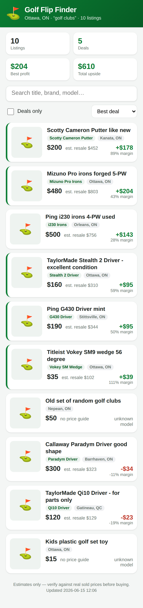

# Golf Flip Finder — Ottawa (Facebook Marketplace)

A real, runnable app that finds underpriced golf clubs on Facebook Marketplace
in **Ottawa, Ontario** and ranks them by how much profit you could make
reselling them. Run one command, open the page on your computer or phone, and
click **Find deals** — it opens a browser for you to log into Facebook, scrapes
live Ottawa listings, estimates each club's resale value (in CAD), and shows the
best flips first.



## Run the app

```bash
cd golf-scraper
python3 -m venv .venv && source .venv/bin/activate
pip install -r requirements.txt
playwright install chromium      # one-time browser download

python -m golf_scraper.app       # starts the app + opens the dashboard
```

You'll see:

```
  ⛳  Golf Flip Finder — Ottawa
     On this computer:  http://localhost:8000/
     On your phone:     http://192.168.1.42:8000/   (same Wi-Fi)
```

Click **Find deals** in the page. A Chromium window opens — log into Facebook
once (the login is remembered for next time), and it scrapes live Ottawa golf
listings and fills the dashboard. **To use it on your phone:** run the command
on a computer on your home Wi-Fi and open the phone URL it prints.

> The scrape runs on the machine hosting the app (where the browser and your
> Facebook login live). Your phone just views the results.

> ⚠️ **Read this first.** Scraping Facebook Marketplace is against Facebook's
> [Terms of Service](https://www.facebook.com/legal/terms). Facebook may rate-limit,
> challenge, or ban accounts that automate access. This tool is built for
> **light, personal, occasional** deal-hunting — it logs in as *you*, scrolls
> gently with human-like pauses, and stores results locally. It does **not**
> bypass logins, solve CAPTCHAs, hide automation, or harvest at scale, and you
> should not modify it to do so. Use it at your own risk, and consider the
> official Facebook Graph API / Commerce APIs if you need a sanctioned feed.
> Resale price estimates are rough guesses, not financial advice — always sanity
> check against real eBay.ca "sold" prices before buying.

## How it works

1. **Scrape** — Playwright opens Chromium with a *persistent profile*. You log
   into Facebook by hand once; the session is reused on later runs. It navigates
   to the Ottawa Marketplace search, scrolls a few times, and reads the cards.
2. **Price** — each listing title is matched against `data/reference_prices.json`
   (brand/model → typical used resale value), adjusted by condition hints in the
   title ("like new", "for parts", etc.).
3. **Score** — it subtracts resale fees and your flat per-item costs to estimate
   profit and margin, then ranks everything best-deal-first.
4. **Track** — results go into a local SQLite DB so you can ask for only the
   listings that are *new since last run* with `--new-only`.

## CLI (optional — for automation)

The same engine is scriptable if you'd rather not use the app. Try it with no
scraping (bundled sample listings):

```bash
python -m golf_scraper.main --demo samples/demo_listings.json
```

A real run, exporting the dashboard and serving it:

```bash
python -m golf_scraper.main \
  --query "golf clubs" \
  --max-price 600 --min-margin 0.4 \
  --new-only --web --serve
```

(Location defaults to Ottawa.) Or use a config file:

```bash
cp config.example.yaml config.yaml   # edit it
python -m golf_scraper.main -c config.yaml
```

## Location & currency

The app is locked to **Ottawa, Ontario** with a CAD price book. The CLI defaults
to Ottawa too but can point elsewhere: open Facebook Marketplace, set your
location and radius, and search — the URL looks like
`facebook.com/marketplace/<location>/search?query=...`. Copy the `<location>`
part (e.g. `toronto`, `montreal`, or a numeric id) into `--location`, and tune
`data/reference_prices.json` to that market.

## Useful flags (CLI)

| Flag | What it does |
|------|--------------|
| `--query` | Search terms (try `"scotty cameron"`, `"taylormade driver"`) |
| `--min-price` / `--max-price` | Price filters passed to Marketplace |
| `--min-margin` | Profit-margin bar for the "deal" flag (`0.4` = 40%) |
| `--fee-pct` | Resale fees you'll pay (default `0.13` for eBay) |
| `--extra-costs` | Flat per-item cost: shipping, cleaning, gas (default `$15`) |
| `--deals-only` | Show only listings that clear the margin bar |
| `--new-only` | Show only listings not seen on a previous run |
| `--csv` / `--json` | Export results |
| `--web` | Refresh the mobile dashboard data (`webapp/data.js`) |
| `--serve [PORT]` | Host the dashboard (default port 8000) to view on your phone |
| `--headless` | Run without a visible window (only after first login) |
| `--max-scrolls` | How far to scroll results — keep modest |

## Tuning the price book — this is the important part

The default `data/reference_prices.json` ships with rough numbers. **Your profit
depends entirely on these being accurate for your market.** For each club you
care about, check recent eBay.ca *sold* listings (and local Facebook "sold"
comparables) and update the `resale` value.
Add new entries for models you flip; the matcher uses the most specific entry
whose keywords all appear in the title (plurals handled, so `iron` matches
`irons`). Point at your own file with `--reference my_prices.json`.

## Tests

```bash
python -m unittest discover -s tests -v
```

The tests cover pricing, deal scoring, ranking, and card parsing — all offline,
no browser required.

## Notes & limits

- Marketplace's HTML changes often; if extraction returns 0 listings, the card
  selectors in `scraper.py` may need updating.
- It reads only the data shown on the search results grid (title, price,
  location, thumbnail). It does not open each listing or message sellers.
- Keep runs occasional and the scroll count low to stay under the radar and be
  respectful of Facebook's infrastructure.
